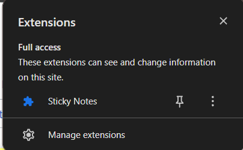
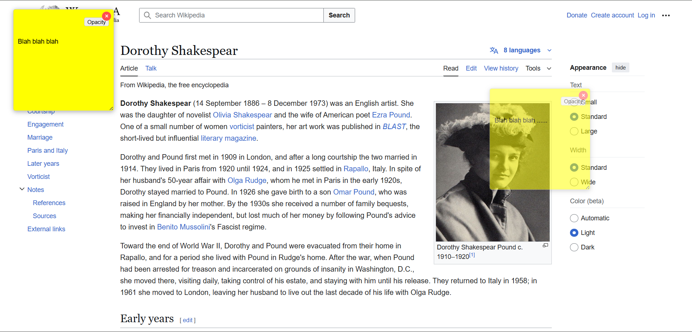
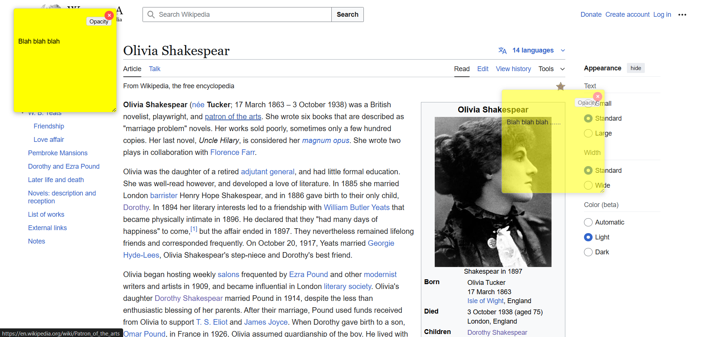

# Sticky Notes Chrome Extension

A lightweight Chrome extension that lets you create, manage, and persist sticky notes across different websites.

## Features

- **Create sticky notes** on any webpage with a single click
- **Notes persist** when navigating between different pages of the same website
- **Save your notes** automatically - they'll be there when you return to the site
- **Drag and position** notes anywhere on the page
- **Adjust opacity** to make notes less intrusive
- **Resize notes** to fit your content
- **Easily delete** notes when you no longer need them

## Screenshots

### Creating a New Note

### Adjusting Opacity

### Notes Persisting Across Pages

## Installation

### From Chrome Web Store
*(Not yet published)*

### Manual Installation (Developer Mode)
1. Download or clone this repository to your local machine
2. Open Chrome and navigate to `chrome://extensions/`
3. Enable "Developer mode" using the toggle in the top right
4. Click "Load unpacked" and select the Chrome-extension folder
5. The extension icon should now appear in your Chrome toolbar

## Usage

1. **Create a note**: Click the Sticky Notes icon in your Chrome toolbar
2. **Write content**: Click on the note and start typing
3. **Move a note**: Click and drag the note to reposition it
4. **Resize a note**: Drag the bottom-right corner to resize
5. **Adjust opacity**: Click the "Opacity" button and use the slider
6. **Delete a note**: Click the × button in the top-right corner of the note

## Technical Details

This extension is built using standard web technologies:
- JavaScript for functionality
- CSS for styling
- Chrome Extension API for browser integration

### Key Components:
- **manifest.json**: Extension configuration
- **background.js**: Handles extension activation and tab management
- **content.js**: Manages note creation, persistence, and interaction
- **note.css**: Styles the sticky notes

### Storage:
- Notes are stored using Chrome's `storage.local` API
- Notes persist per website domain (hostname)
- Global storage ensures notes appear on the correct sites

## Privacy

This extension:
- Does not collect any user data
- Does not transmit any information to external servers
- Only stores your notes locally in your browser
- Requires minimal permissions to function

## Future Enhancements

- Note color customization
- Rich text formatting options
- Note categories/tags
- Export/import notes
- Cloud sync across devices

## Contributing

Feel free to fork this repository and submit pull requests with improvements.

